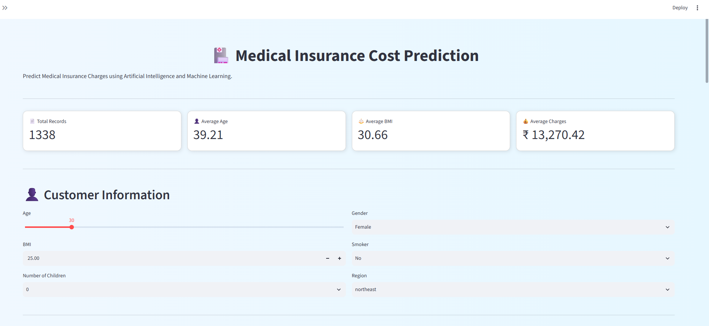
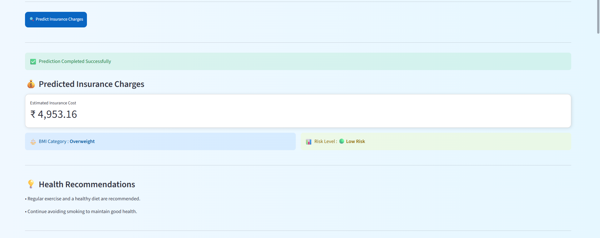
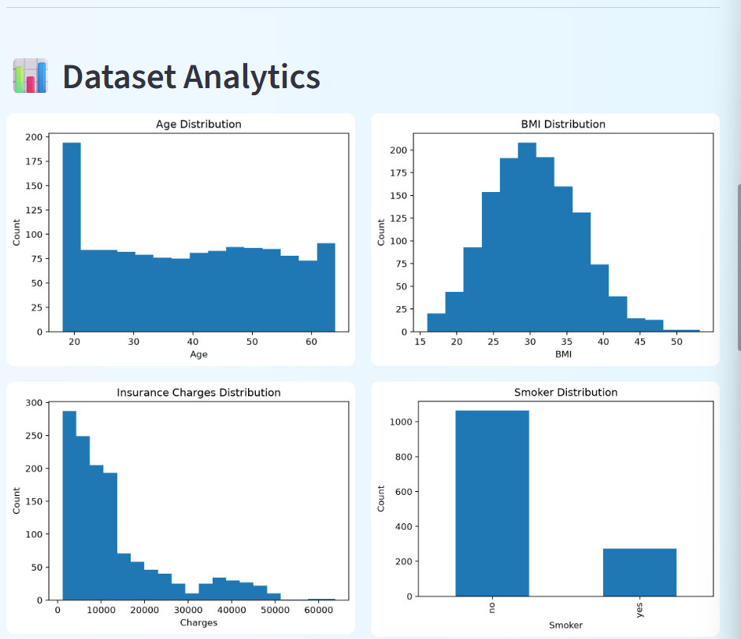
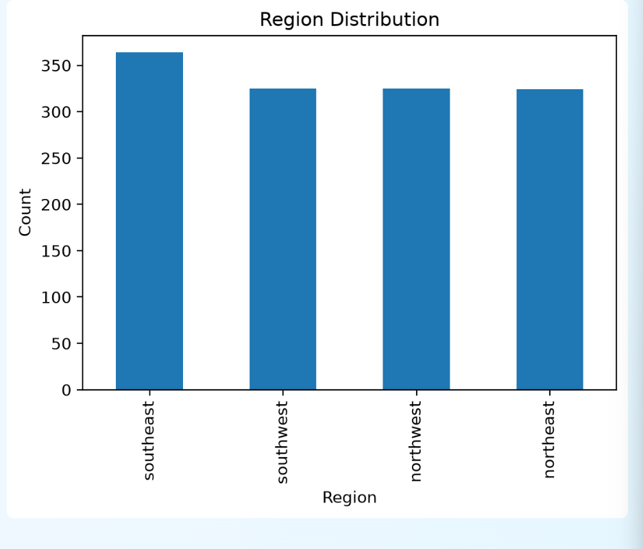
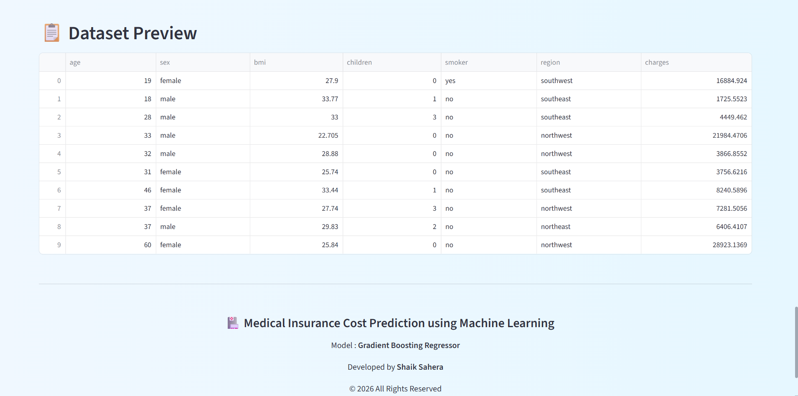

# 🏥 Medical Insurance Cost Prediction

A Machine Learning web application that predicts medical insurance charges based on customer information such as age, BMI, smoking status, number of children, gender, and region.

---

## 🌐 Live Demo

👉 https://medicalinsuranceai-fcyleptsh3fft2dphfehzd.streamlit.app/

---

## 📂 GitHub Repository

👉 https://github.com/shaiksahera0786-collab/Medical_Insurance_AI

---

## 📖 Project Overview

Medical insurance companies estimate premium costs based on multiple health and lifestyle factors.

This project uses Machine Learning to predict insurance charges accurately and provides:

- 💰 Insurance Cost Prediction
- 📊 Interactive Dashboard
- 📈 Data Visualization
- 🩺 BMI Category Detection
- ⚠️ Health Risk Level
- 💡 Health Recommendations

The application is developed using **Python**, **Scikit-learn**, and **Streamlit**.

---

# 🚀 Features

- 💰 Predict Medical Insurance Charges
- 🤖 Machine Learning Powered Prediction
- 📊 Interactive Dashboard
- 📈 Data Visualization
- 🩺 BMI Category Detection
- ⚠️ Health Risk Assessment
- 💡 Personalized Health Recommendations
- 🌐 Streamlit Web Application
- 📱 Responsive User Interface

---

# 🛠️ Tech Stack

### Programming Language

- Python

### Machine Learning

- Scikit-learn
- Gradient Boosting Regressor

### Data Analysis

- Pandas
- NumPy

### Data Visualization

- Matplotlib

### Web Framework

- Streamlit

### Model Saving

- Joblib

### Version Control

- Git
- GitHub

---

# 📁 Project Structure

```text
Medical_Insurance_AI
│
├── app
│   ├── app.py
│   └── static
│       └── style.css
│
├── data
│   ├── insurance.csv
│   ├── cleaned_insurance.csv
│   └── encoded_insurance.csv
│
├── models
│   └── insurance_model.pkl
│
├── notebooks
│   ├── 01_Dataset_Understanding.ipynb
│   ├── 02_Data_Preprocessing.ipynb
│   ├── 03_Exploratory_Data_Analysis.ipynb
│   ├── 04_Feature_Engineering.ipynb
│   ├── 05_Model_Building.ipynb
│   ├── 06_Model_Evaluation.ipynb
│   ├── 07_Model_Comparison.ipynb
│   ├── 08_Hyperparameter_Tuning.ipynb
│   ├── 09_Save_Model.ipynb
│   └── 10_Streamlit_Testing.ipynb
│
├── screenshots
│
├── src
│   ├── __init__.py
│   ├── prediction.py
│   ├── dashboard.py
│   ├── charts.py
│   └── utils.py
│
├── README.md
├── LICENSE
├── requirements.txt
└── .gitignore
```

---


# ⚙️ Installation

Clone the repository:

```bash
git clone https://github.com/shaiksahera0786-collab/Medical_Insurance_AI.git
```

Go to the project folder:

```bash
cd Medical_Insurance_AI
```

Create a virtual environment:

```bash
python -m venv .venv
```

Activate the virtual environment

### Windows

```bash
.venv\Scripts\activate
```

### Install dependencies

```bash
pip install -r requirements.txt
```

Run the Streamlit application

```bash
streamlit run app/app.py
```

The application will open in your browser.

---
# 🤖 Machine Learning Workflow

The project follows a complete end-to-end Machine Learning pipeline.

```
Dataset Collection
        │
        ▼
Dataset Understanding
        │
        ▼
Data Preprocessing
        │
        ▼
Exploratory Data Analysis (EDA)
        │
        ▼
Feature Engineering
        │
        ▼
Model Building
        │
        ▼
Model Evaluation
        │
        ▼
Model Comparison
        │
        ▼
Hyperparameter Tuning
        │
        ▼
Best Model Selection
        │
        ▼
Model Saving
        │
        ▼
Streamlit Web Application
```

---

# 📊 Dataset Information

| Feature | Description |
|----------|-------------|
| Age | Age of the customer |
| Gender | Male / Female |
| BMI | Body Mass Index |
| Children | Number of dependent children |
| Smoker | Smoking status |
| Region | Residential region |
| Charges | Medical insurance charges (Target Variable) |

---

# 🤖 Machine Learning Models Used

The following regression algorithms were trained and compared:

- Linear Regression
- Decision Tree Regressor
- Random Forest Regressor
- Gradient Boosting Regressor
- XGBoost Regressor
- CatBoost Regressor
- LightGBM Regressor

---

# 🏆 Best Performing Model

**Gradient Boosting Regressor**

This model produced the best overall performance and was selected for deployment in the Streamlit application.

---

# 📸 Project Screenshots

## 🏠 Home Page



---

## 🔮 Prediction Result



---

## 📊 Dashboard



---

## 📈 Dataset Analytics



---

## 📄 Dataset Preview



---

## 📋 Prediction Details


---

# 🚀 Future Enhancements

The following features can be added in future versions:

- 📄 Download Prediction Report (PDF)
- 📧 Email Prediction Report
- 📊 Advanced Analytics Dashboard
- 🤖 AI-based Health Suggestions
- ☁️ Cloud Database Integration
- 📱 Mobile Responsive Design
- 🔐 User Authentication
- 🌍 Multi-language Support

---

# 👨‍💻 Developer

**Shaik Sahera**
---

# 📜 License

This project is licensed under the **MIT License**.

See the `LICENSE` file for more information.

---

# 🙏 Acknowledgements

Special thanks to:

- Scikit-learn
- Streamlit
- Pandas
- NumPy
- Matplotlib
- Open Source Community

---

# ⭐ Support

If you found this project useful, please consider giving it a ⭐ on GitHub.

It helps others discover the project and motivates future improvements.

---

# 🎯 Project Status

✅ Completed

✔ Dataset Collected

✔ Data Preprocessed

✔ Feature Engineering

✔ Model Training

✔ Model Evaluation

✔ Model Deployment

✔ Streamlit Web Application

✔ GitHub Repository

✔ Live Deployment

---

# 📬 Contact

For suggestions, collaborations, or feedback, feel free to connect through GitHub.

**Happy Learning! 🚀**